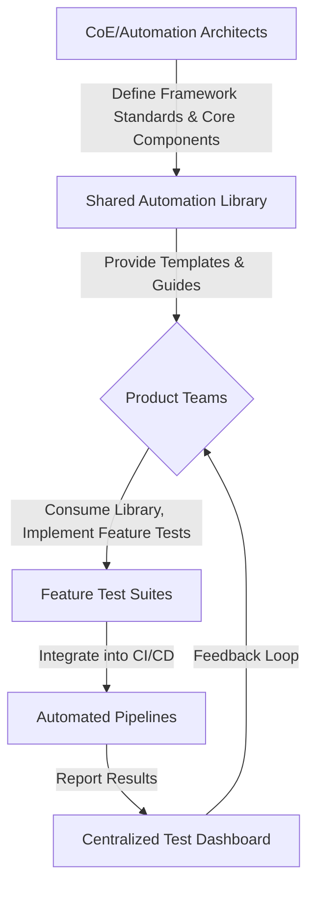

## Overview
Establishing effective automation ownership models is critical for scaling test coverage, enhancing maintainability, and fostering a robust quality culture within modern engineering teams. It dictates how automation assets are developed, maintained, and integrated into the broader SDLC.

### Interview Question:
How do you establish automation ownership models?

### Expert Answer:
Establishing robust automation ownership models is fundamental to scaling test efforts and ensuring long-term maintainability. It involves strategic decisions on team structure, technical governance, and process integration. We primarily consider three models: Centralized, Distributed (DevOps), and Hybrid (Center of Excellence).

1.  **Centralized Model:** A dedicated QA Automation team owns the entire automation suite.
    *   **Technical Implementation:** This team develops and maintains a single, highly standardized framework (e.g., a Playwright/Selenium/Cypress framework leveraging Page Object Model or Component-Based architecture). They implement strict code reviews, maintain shared libraries for common utilities and assertions, and manage CI/CD pipeline integration, defining execution triggers and reporting mechanisms. Consistency is high, but it can create bottlenecks.

2.  **Distributed/DevOps Model:** Product development teams (Devs & QAs) own automation for their specific features or microservices.
    *   **Technical Implementation:** To prevent fragmentation, core architecture principles are critical. We provide standardized framework templates or archetypes (e.g., a `npm create automation-project` boilerplate) that include linters (ESLint), formatters (Prettier), and pre-commit hooks for quality gates. Ownership is at the component or service level. Teams are responsible for writing, maintaining, and integrating their tests into their service's CI/CD. Shared reporting dashboards (e.g., Allure, custom UI) aggregate results across services. This model accelerates feedback loops but demands strong governance and enablement.

3.  **Hybrid Model (Center of Excellence - CoE):** This balances consistency with speed, often our preferred approach. A smaller CoE team focuses on framework architecture, best practices, and enablement, while product teams own feature-specific test implementation.
    *   **Technical Implementation:** The CoE develops and maintains the core automation framework as a versioned internal package (e.g., `@org/automation-core`), providing utility functions, custom reporters, and framework extensions. They define architectural patterns (e.g., abstracting WebDriver interactions, API service layer), implement robust CI/CD pipelines for the core framework, and provide training. Product teams consume this package, write their specific tests following CoE guidelines, and integrate them into their feature branches/PRs. This model leverages monorepos or multi-repo strategies with dependency management. Quality gates include mandatory unit/integration test coverage and end-to-end test execution before deployment. Observability of test runs is paramount, with aggregated metrics on flakiness, execution time, and coverage.

**Key Technical Enablers Across Models:**
*   **Modular Framework Design:** Separation of concerns (test data, page objects/components, utilities).
*   **Version Control & Branching:** Clear GitFlow or Trunk-Based Development strategies.
*   **CI/CD Integration:** Automated triggers, parallel execution, sophisticated reporting.
*   **Code Quality & Standards:** Linters, formatters, static analysis tools, PR review processes.
*   **Comprehensive Documentation:** Readme, contribution guidelines, framework architecture.
*   **Training & Enablement:** Especially crucial for distributed models to ensure consistent skill sets.

### Speaking Blueprint (3-Minute Verbal Response):

[The Hook]
"In today's fast-paced engineering landscape, achieving true testing scalability and maximizing engineering efficiency hinges not just on sophisticated frameworks like Playwright or robust CI/CD pipelines, but critically, on how we define and distribute ownership of our automation assets. Without a clear ownership model, even the most advanced tools can lead to fragmented efforts and unmanageable test suites."

[The Core Execution]
"Our approach typically leans towards a **Hybrid Model**, establishing a 'Center of Excellence' or a core automation team that acts as a technical custodian. This CoE doesn't just dictate; it empowers. Technically, this translates into the CoE being responsible for architecting and maintaining the foundational automation framework, often published as an internal npm package – let's say `@myorg/automation-core`. This package contains common utilities, custom assertion libraries, base page objects or component models, and highly optimized CI/CD pipeline configurations for parallel execution. Product teams, on the other hand, consume this core package. They are then empowered to own and implement their feature-specific tests within their service repositories. To maintain consistency across these distributed efforts, we enforce guardrails through standardized project archetypes, pre-commit hooks that run linters like ESLint and formatters like Prettier, and mandatory peer reviews. We also ensure comprehensive documentation – think clear READMEs, contribution guides, and architectural decision records – which are paramount for developers to effectively contribute and maintain their tests. Furthermore, we leverage unified reporting dashboards, perhaps using Allure or a custom solution, that aggregate results from all teams, providing a holistic view of quality across the enterprise."

[The Punchline]
"Ultimately, this hybrid ownership model fosters a culture of shared responsibility for quality, significantly accelerates feedback cycles by shifting testing left, dramatically reduces technical debt in our automation suite, and, most importantly, boosts our engineering ROI by ensuring automation isn't just an afterthought but an integral, seamlessly integrated part of every development team's workflow."